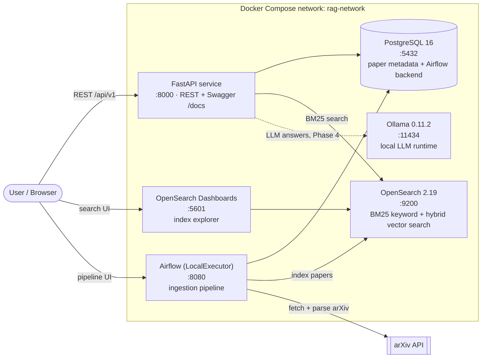

# Agentic Information Retrieval System

### A production-grade, agentic Retrieval-Augmented Generation (RAG) platform — built hands-on, service by service.

<p align="left">
  
  
  
  
  
  
</p>

> Personal engineering project by **[Snehal Gore](https://github.com/snehalgore1)** — MS Computer Science.
> I'm building a production-style **agentic RAG** system from the ground up to master the retrieval, LLM-serving, and MLOps patterns behind real-world AI systems, then adapting it to the **autonomous-vehicle safety** domain (my target industry).

---

## Why I'm building this

I wanted more than a toy notebook. This repo is my end-to-end build of a **research assistant** that ingests academic papers, indexes them for keyword + semantic search, and answers questions with a local LLM — wired together the way production systems actually are: containerized services, an orchestrated ingestion pipeline, observability, caching, and an agentic control layer.

I'm developing it as an intense, multi-phase sprint and documenting the **architecture decisions and trade-offs** at each step, because being able to *explain* a system is what separates "I followed a tutorial" from "I can build this."

**Foundation & attribution — up front and honestly:** the system architecture and weekly curriculum are based on the excellent open-source [**Jam With AI — Production Agentic RAG course**](https://github.com/jamwithai) (MIT licensed). I'm using it as a scaffold, then making it my own: my repo, my environment (Apple Silicon), my commit history, my customizations, and — as the capstone — **re-pointing the system at autonomous-vehicle safety data** (California DMV disengagement reports + NHTSA crash data) plus an original feature. What's mine vs. the foundation is spelled out in [My work vs. the foundation](#my-work-vs-the-foundation).

---

## System architecture

Six containerized services on a single Docker Compose network. Solid arrows are wired and running today; dashed arrows come online in later phases.



**How the pieces relate**

- **FastAPI** is the application surface — the only image built from source (multi-stage `Dockerfile`); everything else is a pinned upstream image.
- **PostgreSQL** does double duty: application store for paper metadata *and* Airflow's own metadata backend.
- **OpenSearch** is the retrieval engine — BM25 keyword search first, then hybrid (keyword + vector) with RRF fusion.
- **Airflow** orchestrates the scheduled fetch → parse → index pipeline.
- **Ollama** runs the LLM locally (on Apple Silicon it will run *natively* for Metal GPU acceleration once RAG answering comes online).
- **OpenSearch Dashboards** is the visual window into the indices.

---

## Key accomplishments so far

**Phase 1 — Infrastructure & environment (complete ✅)**

- **Provisioned and ran the full 6-service stack** (FastAPI, PostgreSQL 16, OpenSearch 2.19, OpenSearch Dashboards, Airflow, Ollama) via Docker Compose on an **Apple Silicon M1 Pro**, with **every container passing its health check**.
- **Verified the system end-to-end:** API health probe reports `database: healthy` and `ollama: healthy`; OpenSearch cluster status `green`; Airflow web server returns `200`.
- **Traced and documented the architecture** into a mental model I can defend in an interview — service responsibilities, container networking (service-name DNS), and startup ordering.
- **Reproducible, thin images:** understood and can explain the **multi-stage Docker build** (build fat with the `uv` toolchain, ship a slim runtime) and **health-check-gated dependency startup** (`depends_on: condition: service_healthy`) so the API never boots ahead of its datastores.
- **Set up a clean, portfolio-oriented Git workflow** (see [Engineering practices](#engineering-practices-i-can-speak-to)) so `main` tells my own week-by-week story while honestly preserving the course baseline as a reference branch.

**Phase 2 — Automated data ingestion (complete ✅)**

- **Built and ran the arXiv ingestion pipeline** (Airflow DAG): fetch metadata → download PDFs → **parse with Docling** → store in Postgres. Verified a *green DAG run that actually stores* — currently **21 papers** with full extracted text.
- **Debugged three real production failures** (the kind that separate "did a tutorial" from "can ship"):
  - **`create_all` doesn't migrate** — a stale Week 1 table was missing new columns; production needs Alembic.
  - **`libGL.so.1` missing in a slim image** — Docling's vision models `dlopen` native libs that slim Docker images omit; fixed the Dockerfile.
  - **NUL bytes + transaction cascade** — a single `\x00` from PDF extraction (rejected by Postgres) aborted the transaction and, because the handler never rolled back, dropped the *entire* batch while reporting success. Fixed the data hygiene **and** the resilience gap, and made the task fail loudly on 0-stored.

**Phase 3 — Search foundations: BM25 + vector + hybrid (complete ✅)**

- **BM25 keyword search:** indexed papers into OpenSearch with a custom analyzer (tokenize → lowercase → stopwords → snowball stemming) and multi-field `text`/`keyword` mappings; **full parsed body text searchable**, with field boosting (`title^3, abstract^2`) via a REST endpoint. Verified explainable ranking (on-topic → clear winner; off-topic → low, flat scores).
- **Vector / semantic search:** chunked papers into ~600-word overlapping segments (**350 chunks / 14 papers**), embedded each with **Jina v3** (1024-dim), and indexed into a `knn_vector` field using **HNSW** approximate-nearest-neighbor.
- **Hybrid search (RRF):** fused BM25 + vector rankings with **Reciprocal Rank Fusion** (`1/(k+rank)`, k=60) via an OpenSearch search pipeline — no score-normalization or manual weights. Exposed a `/hybrid-search` endpoint supporting BM25 / vector / hybrid modes.
- **Real integration lessons:** handled **Jina free-tier rate limits** (429s) with throttled retry; recognized that metadata-only papers (no body text) correctly yield zero chunks.

> Phases 4–6 below are the roadmap ahead, not yet built — tracked honestly so the status is never oversold.

---

## Project status & roadmap

| Phase | Focus | Key technologies | Status |
|------:|-------|------------------|--------|
| **1** | Infrastructure & environment | Docker Compose, FastAPI, PostgreSQL, OpenSearch, Airflow, Ollama | ✅ **Done** |
| **2** | Automated data ingestion | Airflow DAGs, arXiv API, PDF parsing (Docling) | ✅ **Done** |
| **3** | Search foundations | BM25 ✅ · vector/semantic ✅ · **hybrid RRF ✅** · chunking · Jina embeddings | ✅ **Done** |
| **4** | Full RAG with LLM | Ollama (native Metal), prompt design, SSE streaming, UI | 🔜 Planned |
| **5** | Observability & caching | Langfuse tracing, Redis caching, cost/latency analysis | 🔜 Planned |
| **6** | Agentic RAG + delivery | LangGraph (guardrails, doc grading, query rewriting, adaptive retrieval), Telegram bot | 🔜 Planned |
| **★** | **Domain capstone (mine)** | Re-point to **AV safety data** (CA DMV disengagements, NHTSA crashes) + one original feature | 🎯 Goal |

---

## Tech stack

| Layer | Technology |
|-------|-----------|
| API | FastAPI (Uvicorn, 4 workers), Pydantic |
| Datastore | PostgreSQL 16 (SQLAlchemy) |
| Search / retrieval | OpenSearch 2.19 — BM25 + hybrid vector search |
| Orchestration | Apache Airflow (LocalExecutor) |
| LLM serving | Ollama 0.11.2 (local models) |
| Packaging / deploy | Docker & Docker Compose, multi-stage builds |
| Tooling | Python 3.12, `uv` (fast, lockfile-based dependency management) |

---

## Engineering practices I can speak to

- **Multi-stage container builds** — a `uv`-based build stage plus a slim runtime stage → smaller, cleaner production images.
- **Health-check-gated orchestration** — services declare health checks; dependents wait on `service_healthy`, eliminating the classic "app starts before its database" race.
- **Dependency-probing health endpoint** — `/api/v1/health` doesn't just return `200`; it runs `SELECT 1` against Postgres and pings Ollama, returning `degraded` with per-service detail (a real load-balancer probe pattern).
- **12-factor configuration** — all config via environment variables; container-vs-host hostnames handled through per-service overrides.
- **Persistent named volumes** — datastore state survives `docker compose down`.
- **Portfolio-grade Git hygiene** — `main` is my own progressive build; the upstream course's finished solution is preserved on a clearly-labeled `course-complete` reference branch, never presented as my own.
- **Resilient data pipelines** — sanitize model-extracted text before storage (NUL bytes), roll back per-record so one bad row can't poison a batch, and degrade gracefully (store metadata when PDF parsing fails) instead of dropping papers.
- **Fail-loud observability** — an ingestion run that fetches papers but stores zero now raises instead of reporting a false "success."
- **Native-lib debugging in containers** — diagnosed a runtime `dlopen` failure (`libGL.so.1`) in a slim base image and fixed it at the Dockerfile layer.
- **Search relevance engineering** — BM25 scoring (TF · IDF · length-norm) with per-field boosting and custom analyzers; `must` (scored) vs `filter` (cached gate) query composition.
- **Semantic + hybrid retrieval** — text chunking, Jina embeddings, HNSW approximate-nearest-neighbor vector search, and **RRF fusion** to combine keyword + vector rankings without score normalization; understand *why* rank-based fusion beats weighted-sum when score scales differ.
- **Third-party API integration** — API-key config via env, request batching, and **rate-limit (429) handling** with throttled retry.

---

## Getting started

**Prerequisites:** Docker Desktop, Python 3.12+, and [`uv`](https://docs.astral.sh/uv/).

```bash
# 1. Configure environment (defaults work out of the box for Phase 1)
cp .env.example .env

# 2. Install the Python environment from the lockfile
uv sync

# 3. Build & start all services (first run pulls/builds images — a few minutes)
docker compose up --build -d

# 4. Verify
docker compose ps
curl http://localhost:8000/api/v1/health
```

**Service endpoints**

| Service | URL | Notes |
|---------|-----|-------|
| API docs (Swagger) | http://localhost:8000/docs | Interactive API |
| API health | http://localhost:8000/api/v1/health | DB + Ollama probe |
| Airflow | http://localhost:8080 | login `admin` / `admin` |
| OpenSearch Dashboards | http://localhost:5601 | index explorer |
| OpenSearch API | http://localhost:9200 | raw search REST |

---

## Repository structure

```
├── compose.yml            # 6-service Docker Compose definition
├── Dockerfile             # multi-stage build for the FastAPI service
├── src/                   # application code
│   ├── main.py            # FastAPI app + lifespan wiring
│   ├── routers/           # API routes (health, papers, search)
│   ├── services/          # integrations (arxiv, pdf_parser, opensearch, ollama, ...)
│   ├── repositories/      # data access
│   ├── models/ schemas/   # SQLAlchemy models + Pydantic schemas
│   └── config.py          # env-driven settings
├── airflow/dags/          # arxiv_paper_ingestion DAG (fetch → parse → store → index)
├── notebooks/week1-3/     # guided, executed notebooks (setup, ingestion, search)
└── tests/
```

---

## My work vs. the foundation

Being explicit so the boundary is clear:

- **The scaffold (credited):** overall architecture and the weekly curriculum come from the [Jam With AI Production Agentic RAG course](https://github.com/jamwithai) (MIT).
- **What's mine (so far):** running and validating the whole system on my own hardware; this documentation, the architecture diagram, and the design write-ups; the Git/branch strategy; and real code fixes committed on `main` — **NUL-byte sanitization + transaction-rollback hardening** of the ingestion pipeline, a **`libGL` Dockerfile fix** for Docling, and a **fail-loud observability** check on the DAG.
- **What's coming:** the **AV-safety domain adaptation** (CA DMV disengagements + NHTSA crash data) and an original feature that take this beyond the course. These land as my own commits, phase by phase.

---

## Credits & license

- **Foundation:** [Jam With AI — Production Agentic RAG course](https://github.com/jamwithai). Thank you for an outstanding open-source curriculum.
- **License:** MIT — see [`LICENSE`](LICENSE). Original copyright © 2025 Jam With AI is retained as required; my additions are released under the same license.

---

*Built by Snehal Gore as a hands-on study in production AI systems. Actively in development — the roadmap above reflects real, honestly-tracked status.*
